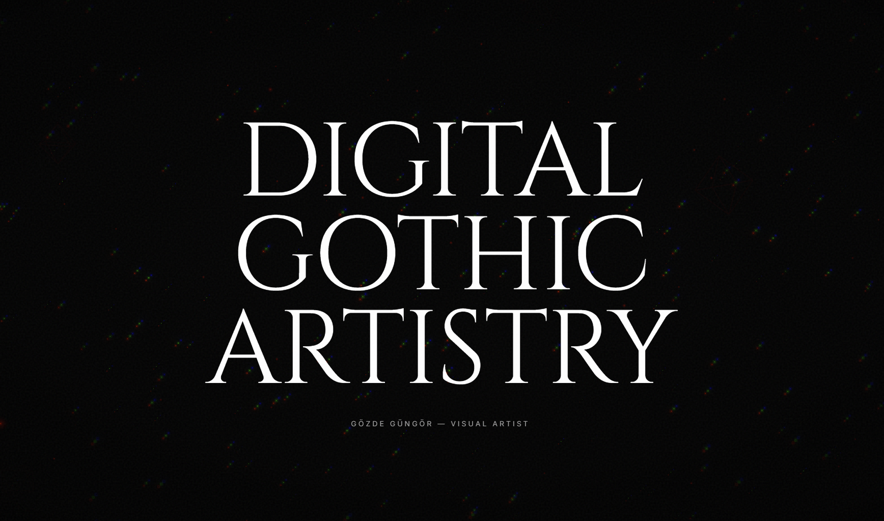

<div align="center">

  

  <br />
  <br />

  # GÖZDE PORTFOLIO
  
  <p align="center">
    <b>Creative Developer • UI/UX Enthusiast • Visual Storyteller</b>
  </p>

  <p align="center">
    A high-end, immersive web experience showcasing the fusion of <br />
    <b>Dark Aesthetics</b>, <b>Interactive 3D</b>, and <b>Seamless Animations</b>.
  </p>

  <br />

  <!-- Tech Stack Badges -->
  <p align="center">
    
    
    
    
    
  </p>

  <br />

  <!-- Discord Button -->
  <a href="https://discord.gg/zq8mQTeBqA">
    
  </a>

</div>

<br />
<hr />

## 🌌 Project Overview

**Gözde Portfolio** is not just a static website; it's a digital journey. Built with a "Gothic/Dark" design philosophy, it challenges the norms of traditional portfolios by integrating 3D environments directly into the DOM structure.

The goal was to create an **Atmospheric Experience** where every scroll, click, and hover feels substantial. By leveraging `react-three-fiber` for the background and `GSAP` for the foreground, the site achieves a unique depth that immerses the visitor.

## 🌟 Key Features

### 🧊 3D Environment
- **Interactive Background**: A living, breathing 3D scene that reacts to mouse movement and scroll position using `Three.js` and `React Three Fiber`.
- **Performance Optimized**: Post-processing effects are carefully tuned to ensure 60fps on modern devices.

### ⚡ Silk-Smooth Interaction
- **Lenis Scroll**: Replaced standard browser scrolling with a custom inertia-based smooth scrolling library for a premium "app-like" feel.
- **Parallax Effects**: Elements move at different speeds, creating a sense of three-dimensional space even in 2D sections.

### 🎨 Gothic & Cyberpunk Aesthetics
- **Glitch Text**: Custom-built text components that randomly glitch on hover, adding a dynamic, cyberpunk edge to the gothic theme.
- **Custom Cursor**: A custom SVG cursor that blends with the background and reacts to interactive elements.
- **Noise & Grain**: Subtle film grain overlays to unify the visual language.

### 🔊 Audio Experience
- **Ambient Sound**: Integrated audio player that enhances the mood without being intrusive.
- **User Control**: Full control over volume and playback state.

## 📂 Project Structure

```bash
src/
├── 📂 components/     # Reusable UI & 3D components
│   ├── 📂 3d/         # Three.js scenes and canvas
│   ├── 📂 layout/     # Structural components (Nav, Cursor)
│   ├── 📂 ui/         # Small UI elements (Buttons, GlitchText)
│   └── 📂 work/       # Project gallery components
├── 📂 hooks/          # Custom React hooks
├── 📂 pages/          # Main route views (Home, About, Work)
├── 📂 styles/         # Global SCSS variables and mixins
├── App.tsx           # Main application entry
└── main.tsx          # DOM mounting point
```

## 🚀 Installation & Development

To run this project locally, ensure you have **Node.js (v18+)** installed.

1.  **Clone the repository**
    ```bash
    git clone https://github.com/ceskasc/gozde-cv.git
    cd gozde-cv
    ```

2.  **Install dependencies**
    ```bash
    npm install
    ```

3.  **Start the development server**
    ```bash
    npm run dev
    ```
    The site will be available at `http://localhost:5173`.

4.  **Build for production**
    ```bash
    npm run build
    ```

## 🛠️ Tech Stack

| Category | Technology | Usage |
|----------|------------|-------|
| **Core** | React 19, TypeScript | Component architecture and type safety |
| **Bundler** | Vite | Lightning-fast HMR and build optimization |
| **3D Engine** | Three.js, R3F, Drei | All 3D rendering and canvas management |
| **Animation** | GSAP, Framer Motion | Timeline-based animations and layout transitions |
| **Styling** | SCSS (Sass) | Modular stylesheets with BEM methodology |
| **Router** | Wouter | Minimalist routing solution |

## 🤝 Contributing

Contributions are what make the open-source community such an amazing place to learn, inspire, and create. Any contributions you make are **greatly appreciated**.

1.  Fork the Project
2.  Create your Feature Branch (`git checkout -b feature/AmazingFeature`)
3.  Commit your Changes (`git commit -m 'Add some AmazingFeature'`)
4.  Push to the Branch (`git push origin feature/AmazingFeature`)
5.  Open a Pull Request

## 📄 License

Distributed under the **MIT License**. See `LICENSE` for more information.

<br />

<div align="center">
  <sub>Designed & Developed with 🖤 by Sadık Can Çeşka</sub>
  <br />
  <a href="#top">Back to Top ⬆️</a>
</div>
